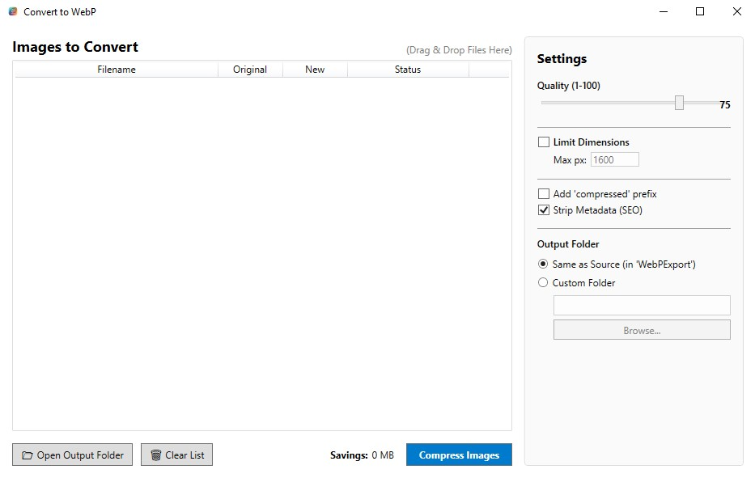

#  Convert to WebP

A high-efficiency Windows desktop application for batch converting images to WebP format. Built with **WPF** and **Magick.NET**.



## Features

*   **Drag & Drop**: Easily add files or folders by dragging them into the application.
*   **Batch Processing**: Convert hundreds of images at once, in parallel across your CPU cores.
*   **Manual Trigger**: Queue files and compress them when ready.
*   **Advanced Settings**:
    *   **Quality Control**: Adjust WebP quality (1-100).
    *   **Compression Effort**: Fast / Balanced / Best trade-off between speed and file size.
    *   **Resize**: Limit max width/height while maintaining aspect ratio.
    *   **Prefix**: Option to add `compressed_` prefix to filenames.
*   **SEO Tools**:
    *   **Metadata Stripping**: Optional setting to remove EXIF/IPTC metadata to reduce file size for web usage.
*   **Output Management**:
    *   Save to a `WebP_Export` subfolder (default).
    *   Or choose a custom output directory.
*   **List Management**: Remove individual items or clear the entire list.

## Downloads

Ready-to-run Windows builds (single-file `.exe`, no .NET installation required) are published on the [Releases](https://github.com/yortem/convert-to-webp/releases) page. Just download the ZIP or EXE and run it.

## Getting Started

### Prerequisites

*   [.NET 8.0 SDK](https://dotnet.microsoft.com/download/dotnet/8.0) or later.
*   Windows 10/11.

### Installation

1.  Clone the repository:
    ```bash
    git clone https://github.com/yortem/convert-to-webp.git
    ```
2.  Navigate to the project directory:
    ```bash
    cd convert-to-webp
    ```
3.  Build and Run:
    ```bash
    dotnet run --project ConvertToWebP.csproj
    ```

## Usage

1.  **Launch** the app.
2.  **Configure** your settings (Quality, Resize, etc.) in the right panel.
3.  **Drag & Drop** images into the left list area.
4.  Click **"Compress Images"**.
5.  Click **"Open Output Folder"** to see your converted files.

## Technology Stack

*   **C# / WPF** (Windows Presentation Foundation)
*   **Magick.NET** (ImageMagick wrapper for .NET)
*   **Newtonsoft.Json** (Settings persistence)

## Configuration

Settings are saved automatically to `%AppData%\ConvertToWebP\settings.json`.
